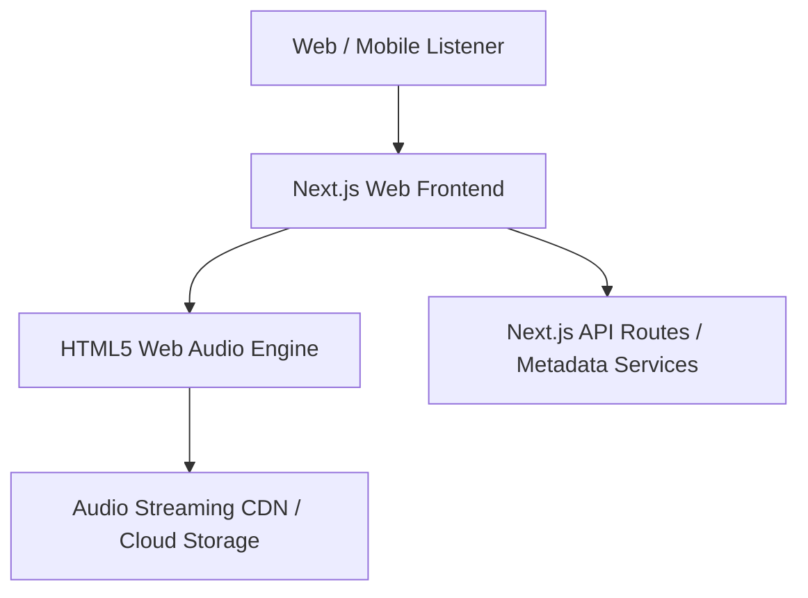
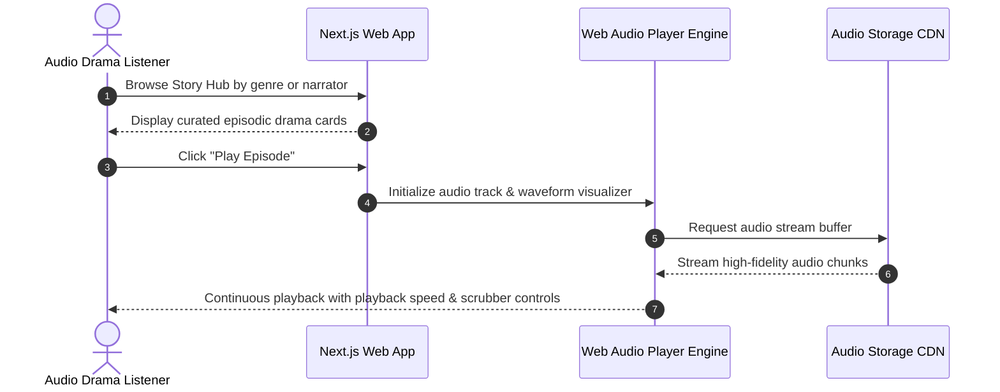

# AweTales — Voice-First Audio Storytelling & Podcast Platform

[]()
[]()
[]()

## Overview
AweTales is an immersive digital storytelling and interactive voice entertainment platform built with Next.js 15, React, and modern Web Audio APIs. Designed around the motto 'Every Story Begins with Your Voice', AweTales connects listeners, narrators, and storytellers into a community for episodic podcasts, interactive audio dramas, and community voice chronicles.

## Features
- **Story Hub Exploration:** Curated audio catalog organized by genre, narrator, and series.
- **High-Fidelity Audio Player:** Continuous playback, custom waveforms, speed control, and chapter bookmarks.
- **Narrator Profiles:** Dedicated artist showcases with episode libraries and creator bios.
- **Responsive Media Design:** Mobile-first audio streaming experience with glassmorphism visual styling.

## Architecture


## User Flow


## Technology Stack
| Layer | Technology | Purpose |
|---|---|---|
| Framework | Next.js 15 | SSR/SSG audio application framework |
| Language | TypeScript | Strong typing across audio contracts and UI components |
| Audio Engine | HTML5 Web Audio API | Low-latency audio playback and waveform analysis |
| UI & Styling | Tailwind CSS, Lucide React | Immersive dark audio player interface |

## Infrastructure
- **Server Port:** 3000
- **Audio CDN:** Cloud Storage / Audio CDN streaming endpoints
- **Deployment Platform:** Vercel / Cloudflare Pages

## Project Structure
```text
AweTales/
├── src/
│   ├── app/             # Next.js App Router (story hub, player, creator profiles)
│   ├── components/      # AudioPlayer, EpisodeCard, WaveformVisualizer, Navbar
│   ├── hooks/           # useAudioPlayer, useMediaSession hooks
│   └── lib/             # Audio format helpers and mock catalog
├── public/              # High-res cover art and audio samples
├── package.json         # Project dependencies
├── .env.example         # Environment template
├── .gitignore           # Git ignore definitions
└── README.md            # Technical documentation
```

## Prerequisites
- Node.js >= 18.x
- npm >= 9.x

## Environment Variables
Copy `.env.example` to `.env.local` and configure placeholders:
```env
NEXT_PUBLIC_CDN_BASE_URL=https://cdn.awetales.example.com/audio
NEXT_PUBLIC_ANALYTICS_ID=your_analytics_id_optional
```

## Local Development Setup
1. Clone the repository:
   ```bash
   git clone https://github.com/Bhanutejanallamothu/AweTales.git
   cd AweTales
   ```
2. Install dependencies:
   ```bash
   npm install
   ```
3. Run the development server:
   ```bash
   npm run dev
   ```
4. Open `http://localhost:3000` to stream stories.

## Docker Setup
*Not detected in repository. Standard Next.js container configuration supported.*

## Database Setup
*Not applicable in current prototype. Metadata is statically loaded from structured TypeScript datasets.*

## API Documentation
- `GET /api/stories` - Retrieve list of available audio episodes.
- `GET /api/stories/:id` - Retrieve detailed metadata and stream URL for a story.

## Deployment
```bash
npm run build
npm start
```
Deployable seamlessly to Vercel or Node.js production servers.

## Security
- Audio stream URLs protected from hotlinking via signed token validation.
- Sanitized user feedback and comments inputs.

## Testing
```bash
npm run lint
```

## Troubleshooting
- **Audio Playback Blocked:** Modern browsers require user interaction (click/touch) before initiating audio playback due to autoplay policies.

## Future Improvements
- Background audio playback via native MediaSession API.
- User narration submission portal with in-browser voice recording and noise reduction.

## License
All rights reserved by repository owner.
